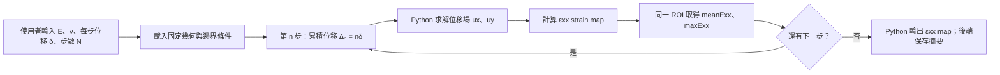

# 二維長方形材料水平拉伸：計算力學流程

本文件記錄目前討論的**計算力學流程**。目標是由使用者指定材料係數、每步水平位移增量與步數，使用 Python 求得各步的水平正應變 εxx map；API 與資料保存範圍另見 [NOTES](NOTES.md)。

## 1. 模型與假設

- 幾何：固定尺寸的長方形薄片，水平初始長度 L₀ = 100 mm、垂直高度 H = 50 mm、z 方向厚度 t = 1 mm。幾何及二維計算區域都以 mm 定義：x = 0～100 mm、y = 0～50 mm。
- 材料：均質、等向、線彈性；使用楊氏模數 E 與蒲松比 ν。第一版採小變形、準靜態分析，忽略慣性、塑性與重力等體力。
- 載入方式：**位移控制**。使用者指定的是右側邊界的水平位移，不是以牛頓表示的外力。
- 邊界條件固定，不由使用者修改。**整條左邊界由夾具固定：ux = 0、uy = 0。**右邊界施加 ux = Δₙ，uy 保持自由，由求解器決定；上下邊界為自由表面，不施加表面力，也不固定位移。
- 二維力學假設固定為**平面應力**：薄片的 z 方向兩個表面視為自由，厚度方向應力 σzz 約為 0；厚度方向應變 εzz 不一定是 0。厚度 t 為模型常數，不由使用者輸入。[平面應力模型說明](https://doc.comsol.com/6.4/doc/com.comsol.help.sme/sme_ug_modeling.05.016.html)。

先前提到「另固定一點的 uy = 0」，是**只有整條左邊界 ux = 0、但 uy 可自由移動**時，用一個點（例如左下角）限制整體沿 y 方向平移的做法。現在整條左邊界的 uy 都固定為 0，已經排除這種剛體平移，因此**不需要再額外固定一點**。[固定約束的定義](https://doc.comsol.com/6.3/doc/com.comsol.help.sme/sme_ug_solid.07.063.html)。

## 2. 使用者輸入

| 輸入 | 意義 | 單位 |
| --- | --- | --- |
| `youngModulusMpa` | 楊氏模數 E | MPa |
| `poissonRatio` | 蒲松比 ν | 無單位 |
| `displacementIncrementMm` | 每步增加的水平位移 δ | mm |
| `stepCount` | 總步數 N | 整數 |

第一版假設每步使用相同的位移增量。驗證規則為：E、δ 必須為正的有限數值；`poissonRatio` 必須為有限數值且 0 ≤ ν ≤ 0.49；`stepCount` 必須為 1～100 的整數；N × δ ≤ 1 mm。違反規則回 HTTP `400`。這個 ν 範圍是第一版對一般正蒲松比材料的支援範圍；等向線彈性的理論範圍更廣，包含負蒲松比材料。[線彈性材料穩定條件](https://docs.software.vt.edu/abaqusv2025/English/SIMACAEMATRefMap/simamat-c-linearelastic.htm)。若未來需要每一步有不同位移，改為輸入位移清單；此時步數可由清單長度決定。

API 輸入的 E 為 MPa、δ 為 mm；固定幾何與 ROI 也以 mm 定義，ν 與應變無單位。只有 Python 的求解入口負責一次性換算：E × 10⁶ 轉為 Pa，幾何座標、ROI 與位移 × 10⁻³ 轉為 m；求解器內部統一使用 Pa、m。Java 不再換算，後續 Python 計算也不重複換算。`appliedDisplacementMm` 直接由原始 mm 輸入計算為 n × δ，對外仍以 mm 回傳。MPa 是應力與楊氏模數的單位；若日後計算力，單位才是 N。

固定厚度 t = 1 mm，相對於 H = 50 mm 與 L₀ = 100 mm 較薄，用來表達平面應力的幾何假設。在本案的均質、固定厚度、純位移控制且無體力模型中，厚度不改變求得的平面內位移與 εxx；若日後計算總反作用力，則須使用厚度換算。

## 3. Python 有限元素法與取樣區域

- 使用二維**平面應力有限元素法**求靜態位移場 `ux(x,y)`、`uy(x,y)`。固定使用 100 × 50 個雙線性四邊形元素（每格 1 × 1 mm，101 × 51 個節點）。平面應力的二維材料參數為 λ = Eν/(1−ν²)、μ = E/[2(1+ν)]；組裝時不能把平面應變的 λ 直接套用。Python 可用 `scikit-fem` 組裝、SciPy 稀疏線性求解器求解。[scikit-fem 文件](https://scikit-fem.readthedocs.io/en/latest/)、[平面應力有限元素範例](https://docs.fenicsproject.org/dolfinx/main/python/demos/demo_static-condensation.html)。
- 在每個元素中心計算 εxx = ∂ux/∂x，形成 100 × 50、共 5,000 個取樣值的 map；因此 `maxExx` 指**取樣值的最大值**，不是未取樣位置的連續場極大值。
- 固定 ROI 採**未變形試片**的中央區域：20 ≤ x ≤ 80 mm、10 ≤ y ≤ 40 mm，相當於水平與垂直方向都取中央 60%。以元素中心是否落在 ROI 內決定取樣；本網格的中心座標為 x = 20.5～79.5 mm、y = 10.5～39.5 mm，共 60 × 30 = 1,800 個值。此區避開固定端、施加位移端及上下自由邊界，所有步驟使用同一 ROI。
- `meanExx` 是 ROI 中 1,800 個等面積元素中心值的算術平均，`maxExx` 是其中最大值。實作後至少以更細網格重算代表性輸入，比較兩項摘要；若差異明顯，須加密網格後才把數值當作可靠結果。

本專案統一使用 `backend` conda 環境（見 [environment.yaml](environment.yaml)）；Python 求解器及其套件也必須安裝在此環境。必要套件為 `scikit-fem`、`numpy`、`scipy`，需 Python 3.10 以上；若需要輸出 map 圖片，再加裝選用的 `matplotlib`。固定網格由程式建立，不需要 `meshio`。目前 `backend` 只有 OpenJDK 與 `libzlib`，尚無 Python；實作前須將 Python 與必要套件加入 `environment.yaml`，再更新 `backend` 環境，避免使用環境外的 `python3` 或 `python3.11`。

## 4. 每一步的計算

對 n = 1, 2, …, N：

1. 計算該步相對於初始狀態的**累積施加位移**：
   **Δₙ = n × δ**
   例如 δ = 0.1 mm，前三步的目標位移為 0.1、0.2、0.3 mm，而不是每一步都只報 0.1 mm。
2. 將 Δₙ 套用到右側邊界，同時保持左側夾具的 ux = uy = 0。Python 根據材料、幾何與邊界條件求得位移場 ux(x,y)、uy(x,y)。在線彈性準靜態模型中，各步可視為不同目標位移下的平衡解。
3. 由位移場計算小應變的水平正應變：
   **εxx(x,y) = ∂ux/∂x**
   整個空間分布就是該步的 **εxx strain map**；應變是無單位比例，例如 0.002 等於 0.2%。
4. 在上述固定 ROI 內計算 `meanExx` 與 `maxExx`。Python 可輸出完整 εxx map 檔案供展示；第一版後端只保存並回傳每步的摘要數字，不儲存完整 map。由於模型是線彈性的，相同材料與邊界條件下可先求一次基準位移場，再按 Δₙ 的比例縮放各步位移與應變。

N × δ ≤ 1 mm 對 100 mm 試片相當於整體工程應變上限 1%，只是第一版的小變形使用界線，無法保證特定材料不會降伏。單步位移沒有另一個固定上限，而是由步數決定：δ ≤ 1/N mm。例如 10 步時 δ = 0.01 mm 可展示較小的總位移 0.1 mm；δ = 0.1 mm 則恰好達到總位移上限 1 mm。100 步時 δ 最多 0.01 mm。

## 5. 結果與檢核

每一步的後端結果為 `step`、`appliedDisplacementMm`、`meanExx`、`maxExx`。物理輸出只展示水平正應變 εxx；不增加 εyy、剪應變、應力或反作用力等結果欄位。Python 產生的 εxx map 可另作視覺展示。

用整體工程應變 Δₙ/L₀ 作為第一個合理性檢查。現在 L₀ = 100 mm；例如第一步 Δ₁ = 0.1 mm 時，基準值是 0.1/100 = 0.001（0.1%）。整條左邊界的 uy 也被夾具限制，可能抑制夾具附近的橫向收縮，使 εxx map 不完全均勻；因此不能要求每個位置的 εxx 或 `maxExx` 都等於 Δₙ/L₀。現在 ROI 只取中間區域，`meanExx` 也未必等於 Δₙ/L₀。若地圖有局部高值，應先檢查邊界、網格與 ROI，而非直接視為材料局部失效。[固定端與蒲松效應的例子](https://www.comsol.com/blogs/computing-stiffness-linear-elastic-structures-part-2)。

**材料係數的解讀：**在這種均質線彈性、指定位移的平面應力模型中，改變 E 主要改變應力或反作用力，通常不改變位移與 εxx。由於左端夾具限制橫向位移，ν 可能影響靠近夾具的局部應變分布；因此不能直接把整張 map 當成均勻單軸應變。這是由線彈性關係與上述邊界條件得到的推論。[參考：COMSOL 線彈性位移與反作用力說明](https://www.comsol.com/blogs?p=29033)。

## 6. 計算失敗與逾時

同步 `POST /simulations` 的 Python 計算逾時門檻先定為 30 秒。Python 異常結束、輸出無效或數值非有限時，API 回 HTTP `500`、`{"code":"CALCULATION_FAILED","message":"Calculation failed."}`；逾時時回 HTTP `500`、`{"code":"CALCULATION_TIMEOUT","message":"Calculation timed out."}`。兩種情況都不保存未完成的模擬或部分步驟結果；伺服器記錄詳細錯誤，對外訊息維持上述英文。
